# AWS ECS Fargate Terraform CI/CD

このプロジェクトは、今までに学習したTerraform、GitHubActionsを使用して AWS 上に ECS Fargate 環境を構築し、アプリケーションをデプロイするための CI/CD パイプラインを提供します。

## アーキテクチャ



プロジェクトのアーキテクチャ図は `images/architecture.drawio` および `images/architecture.svg` にあります。

- **VPC**: プライベートサブネットとパブリックサブネットを含む仮想ネットワーク
- **ALB**: Application Load Balancer でトラフィックを分散
- **ECS Fargate**: サーバーレスコンテナ実行環境
- **ECR**: Elastic Container Registry でコンテナイメージを管理
- **RDS**: MySQL データベース

## 前提条件

- AWS CLI がインストールされ、適切な権限を持つ IAM ユーザーで設定されていること
- Terraform v1.0 以上がインストールされていること
- Docker がインストールされていること
- Python 3.9 以上がインストールされていること (ローカルテスト用)

## セットアップ

1. リポジトリをクローンします：

   ```bash
   git clone <repository-url>
   cd aws-ecs-fargate-terraform-cicd
   ```

2. Terraform の変数を設定します：

   `terraform.tfvars` ファイルを編集して、以下の変数を設定してください：

   - `db_username`: RDS データベースのユーザー名
   - `db_password`: RDS データベースのパスワード

3. Terraform を初期化します：

   ```bash
   terraform init
   ```

4. インフラを構築します：

   ```bash
   terraform plan
   terraform apply
   ```

## CI/CD セットアップ

このプロジェクトでは GitHub Actions を使用して CI/CD を自動化しています。

### GitHub Secrets の設定

GitHub リポジトリの Settings > Secrets and variables > Actions で以下のシークレットを設定してください：

- `AWS_ACCESS_KEY_ID`: AWS アクセスキー ID
- `AWS_SECRET_ACCESS_KEY`: AWS シークレットアクセスキー
- `DB_USERNAME`: RDS データベースのユーザー名
- `DB_PASSWORD`: RDS データベースのパスワード

### ワークフロー

- **main ブランチへのプッシュ**: コードの検証、テスト、Terraform の plan と apply（インフラ構築）、Docker イメージのビルドと ECR プッシュ、ECS サービスの更新が行われます。
- **プルリクエスト**: コードの検証とテストのみ実行されます。

ワークフローファイル: `.github/workflows/deploy.yml`

## 使用技術

- **Infrastructure as Code**: Terraform
- **Cloud Provider**: AWS (VPC, ALB, ECS Fargate, ECR, RDS)
- **CI/CD**: GitHub Actions
- **Containerization**: Docker
- **Programming Language**: Python
- **Web Framework**: FastAPI
- **Database**: MySQL

## 設計方針・意図

- ECS Task は 1Task / 2コンテナ構成とし、
  - 公式イメージ（nginx）
  - Dockerfile からビルドしたアプリケーション
  を同一 Task 内で動作させています。

- アプリケーションコンテナは直接外部公開せず、
  ALB → ECS（nginx）経由のみアクセス可能としています。
  これはセキュリティ境界を ALB に集約する設計を意識したものです。

- ECS の network mode は awsvpc を採用し、
  Security Group を Task 単位で制御できるようにしています。

## アプリケーションのデプロイ

アプリケーションのデプロイは GitHub Actions により自動化されています。main ブランチへのプッシュ時にインフラ構築とアプリケーションデプロイが行われます。

手動デプロイが必要な場合は、以下の手順を実行してください：

1. ECR リポジトリにイメージをプッシュします：

   ```bash
   # ECR にログイン
   aws ecr get-login-password --region ap-northeast-1 | docker login --username AWS --password-stdin <account-id>.dkr.ecr.ap-northeast-1.amazonaws.com

   # イメージをビルド
   docker build -t ecs-app ./app

   # イメージにタグ付け
   docker tag ecs-app:latest <account-id>.dkr.ecr.ap-northeast-1.amazonaws.com/ecs-app:latest

   # ECR にプッシュ
   docker push <account-id>.dkr.ecr.ap-northeast-1.amazonaws.com/ecs-app:latest
   ```

2. ECS サービスを更新して新しいイメージを使用します。

## 使用方法

インフラが構築された後、ALB の DNS 名を使用してアプリケーションにアクセスできます。

- エンドポイント: `http://<alb-dns-name>/`
- レスポンス: `{"message": "Hello from ECS app container"}`

## クリーンアップ

インフラを削除するには：

```bash
terraform destroy
```

## 制約・今後の改善点

- 今後の改善点として、以下の追加が必要と考えています
  - IAM 権限の最小化
  - CloudWatch Alarms による監視強化
  - Secrets Manager を用いた機密情報管理
